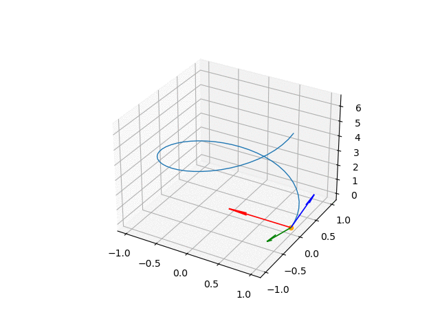
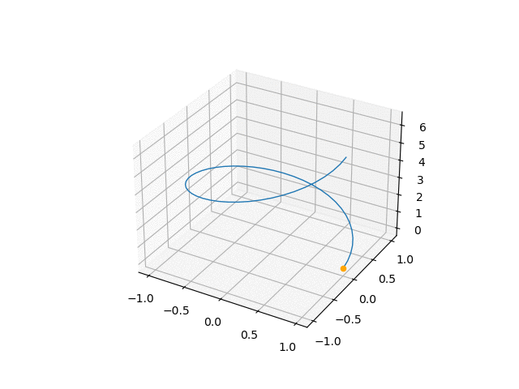
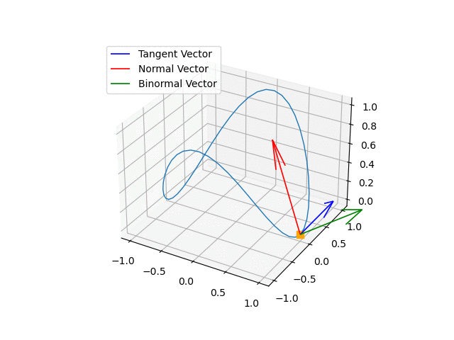

1) Determine o movimento de uma partícula ao longo de uma hélice circular com funções paramétricas $\vec{r}(t) = cos(t) \hat{i} +sin(t) \hat{j}  + t \hat{k}$ , com $0 < t < 3\pi$ e seus respectivos vetores tangente, normal e binormal.

## Vetor Tangente
Para determinar o vetor tangente unitário, basta calcular a derivada da função parmétrica:
$$\vec{r}'(t) = -\sin t \hat{i} +\cos t \hat{j}+ 1\hat{k} = <-\sin t,\cos t, 1>$$
A norma da derivada:
$$\| \vec{r}'(t) \| =\sqrt{ -\sin ^2 (t) \hat{i} +\cos^2(t) \hat{j}+ 1^2\hat{k}} = \sqrt{2}$$
$$\vec{T}(t) = \frac{\vec{r}'(t)}{\|\vec{r}'(t)\|}$$
$$\vec{T}(t) = \frac{\vec{r}'(t)}{\|\vec{r}'(t)\|} = \frac{1}{\sqrt{2}}\cdot<-\sin (t),\cos(t) ,1>$$

## Vetor Normal
O vetor normal unitário pode ser calculado através da derivada do vetor tangente sobre o seu módulo.
$$\vec{T}(t) = \frac{1}{\sqrt{2}} \cdot <-\sin t, \cos t, 1>$$
$$\vec{T}'(t) = \frac{1}{\sqrt{2}}\cdot <-\cos t ,-\sin(t),0>$$
$$\| \vec{T}'(t) \| =\sqrt{ \frac{1}{2}\cdot (-\cos^2 (t) \hat{i} -\sin^2(t) \hat{j})} = \frac{1}{\sqrt{2}}$$
$$\vec{N}(t) = \frac{\vec{T}'(t)}{\|\vec{T}'(t)\|}$$
$$\vec{N}(t) = \frac{\vec{T}'(t)}{\|\vec{T}'(t)\|} = \frac{1}{\sqrt{2}}\cdot <-\cos t,-\sin t,0> \cdot \sqrt{2}$$
$$\vec{N}(t) =<-\cos t,-\sin t,0>$$
## Vetor Binormal
Pode ser encontrado através do produto vetorial entre $N(t)$ e $B(t)$, é perpendicular entre ambos.
$$\vec{B}(t) = \vec{T}(t)\times \vec{N}(t)$$
$$\vec{B}(t) =  \frac{1}{\sqrt{2}} \cdot \begin{vmatrix} 
  \hat{i} & \hat{j} & \hat{k}\\ 
  -\sin(t) & \cos(t) & 1\\
  -\cos(t) & -\sin(t) & 0\\
  \end{vmatrix} = \frac{1}{\sqrt{2}} \cdot<\sin t,-\cos t,1>$$
  
  ---
## Plotagem do Gráfico
1) Para visualizarmos as informações que acabamos de calcular, usaremos Jupyter Notebook e algumas bibliotecas.
```
import sympy as sp
import numpy as np
import matplotlib.pyplot as plt
from sympy.vector import CoordSys3D
```

A biblioteca Sympy nos auxiliará a realizar os cálculos diferenciais das funções vetoriais, Numpy flexibilizará a conversão das funções para serem plotadas e Matplotlib exibirá os gráficos.


2) É conveniente criar uma função que calcula o módulo das funções vetoriais:
```
def norma(vector):
    tamanho = sp.simplify(sp.sqrt(sp.vector.dot(vector,vector)))
    return tamanho
```

3) Neste instante, já estamos aptos a apropriarmo-nos da função vetorial da hélice circular e realizarmos os cálculos vetoriais.

Primeiramente, precisamos pensar em uma forma favorável de manipular os vetores. O Sympy fornece a função _CoordSys3D_ que habilita um sistema de coordenadas tridimensionais e a função _Symbols_ identifica quais são as variáveis que serão manipuladas no cálculo diferencial.
```
C = sp.vector.CoordSys3D('C')
t = sp.symbols('t')
```

Sendo assim, definiremos a variavel ```r``` do programa que representará a função vetorial da trajetória da partícula que é dada por $\vec{r}(t) = cos(t) \hat{i} +sin(t) \hat{j}  + t \hat{k}$.  A variável ```r_1``` representa a derivada da função definida em ```r```. Para calcular a derivada usamos a função ```sympy.diff``` e a variavel a ser derivada será ```t```.  
```
r = sp.cos(t)*C.i+sp.sin(t)*C.j+t*C.k
r_1 = sp.diff(r,t)
```

Fazemos de modo semelhante para o **vetor unitário tangente** $T(t)$, dividindo ```r_1``` pela norma de ```r_1``` com o auxílio da função ```norma()```definida anteriormente. E consequentemente de modo análogo, o **vetor unitário normal** $N(t)$.
```
T = r_1/norma(r_1)
T_1 = sp.diff(T,t)

N = T_1/mod(T_1)
```

Por fim, definimos o **vetor unitário binormal** $B(t)$ basta realizar o produto vetorial de $T(t)$ com $N(t)$ através da função ```sympy.vector.cross``` e simplificar ```sympy.simplify```.
```
B = sp.simplify(sp.vector.cross(T,N))
```

---

A partir de agora, partiremos para a plotagem do gráfico. É importante a partir de agora, definirmos o intervalo da nossa variável, como proposto pelo exercício de $0 < t < 2 \pi$
```
t_vals = np.linspace(0, 2*np.pi, 50)
t_vals_n = np.arange(0, 50, 1)
```

```
for i_,n_ in zip(t_vals,t_vals_n):
    ax = plt.axes(projection='3d')
    ax.plot(rx(t_vals),ry(t_vals),rz(t_vals),linewidth=1)
    ax.scatter(rx(i_),ry(i_),rz(i_),c='orange',marker='s',s=60)
    ax.quiver(rx(i_),ry(i_),rz(i_),Tx(i_),Ty(i_),Tz(i_),color='blue',linewidth=1.2,label='Tangent Vector')
    ax.quiver(rx(i_),ry(i_),rz(i_),Nx(i_),Ny(i_),Nz(i_),color='red',linewidth=1.2,label='Normal Vector')
    ax.quiver(rx(i_),ry(i_),rz(i_),Bx(i_),By(i_),Bz(i_),color='green',linewidth=1.2, label='Binormal Vector')
    plt.legend()
    plt.savefig('/home/antenor/Documents/IC/b/'+str(n_)+'.png')
```




