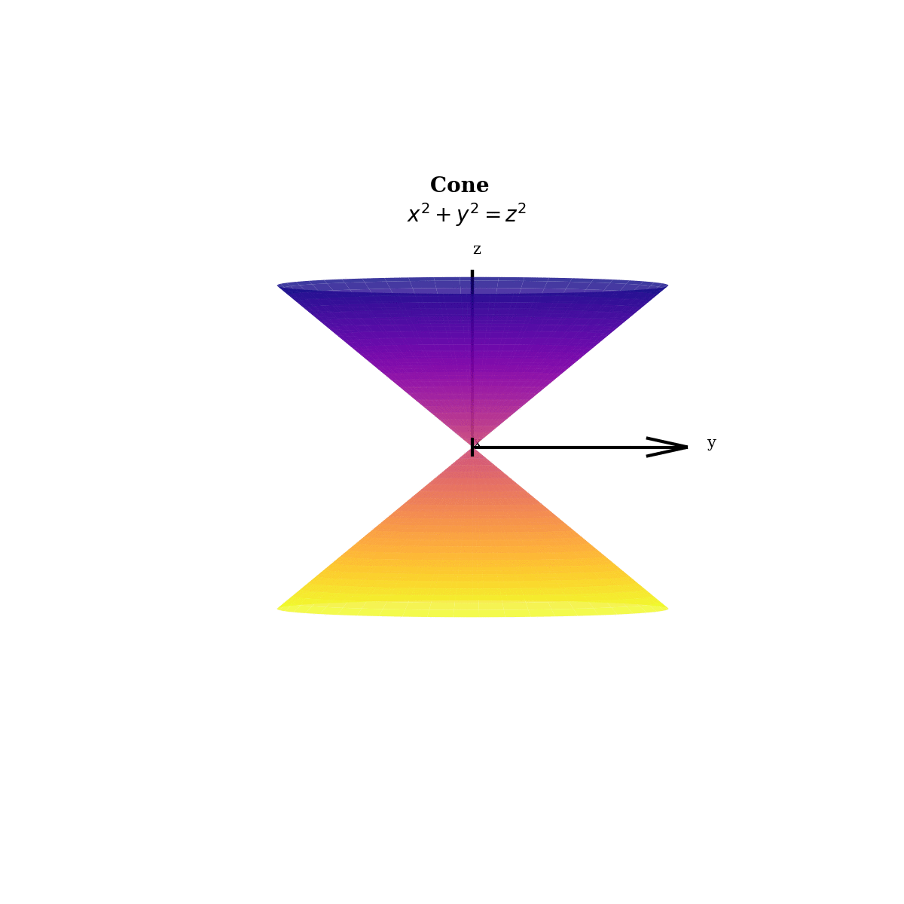
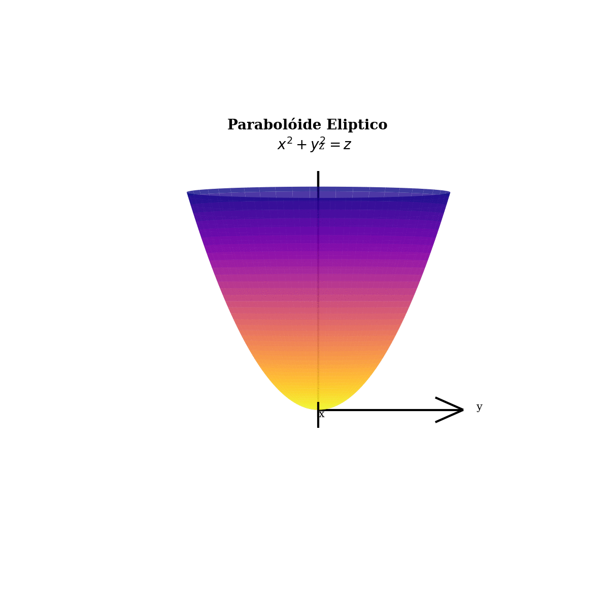
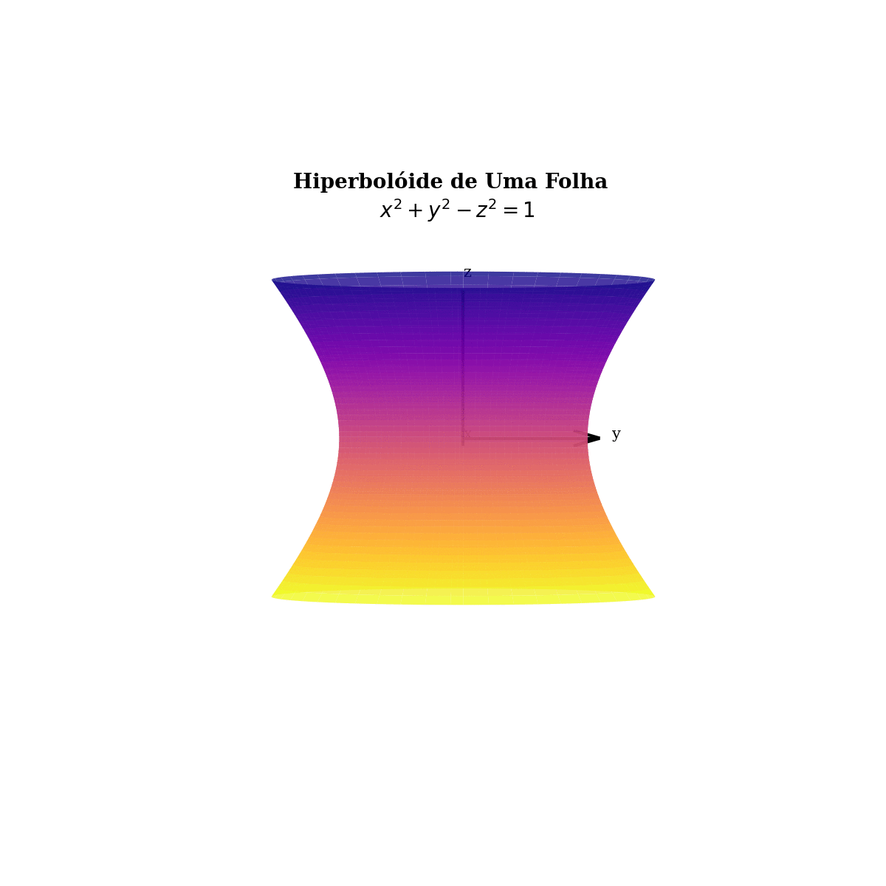

# Superfícies Quádricas

- Cilíndro:
$\LARGE \frac{x ^ 2}{a ^ 2} \normalsize + \LARGE \frac{y ^ 2}{b ^ 2} \normalsize = 1$  

- Elipsóide:
$\LARGE \frac{x ^ 2}{a ^ 2} \normalsize + \LARGE \frac{y ^ 2}{b ^ 2} \normalsize + \LARGE\frac{z^ 2}{c^ 2} \normalsize = 1$  

- Cone:
$\LARGE \frac{x ^ 2}{a ^ 2} \normalsize + \LARGE \frac{y ^ 2}{b ^ 2} \normalsize = \LARGE \frac{z^ 2}{c^ 2}$  

  
- Parabolóide Eliptico:
$\LARGE \frac{x ^ 2}{a ^ 2} \normalsize + \LARGE \frac{y ^ 2}{b ^ 2} \normalsize = \LARGE \frac{z}{c}$  

  
- Hiperboloide de Uma Folha:
$\LARGE \frac{x ^ 2}{a ^ 2} \normalsize + \LARGE \frac{y ^ 2}{b ^ 2} \normalsize - \LARGE \frac{z^ 2}{c^ 2} \normalsize = 1$  

  
- Parabolóide Hiperbólico:
$\LARGE \frac{x ^ 2}{a ^ 2} \normalsize - \LARGE \frac{y ^ 2}{b ^ 2} \normalsize = \LARGE \frac{z}{c}$  

  
- Hiperbolóide de Duas Folhas:
$-\LARGE \frac{x ^ 2}{a ^ 2} \normalsize - \LARGE \frac{y ^ 2}{b ^ 2} \normalsize + \LARGE \frac{z^ 2}{c^ 2} \normalsize = 1$

.gif)